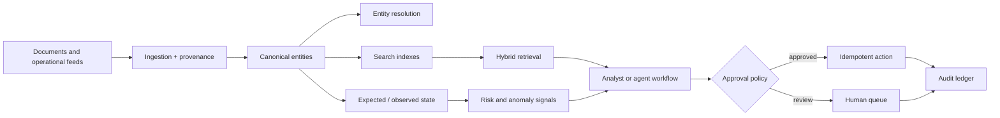

# Procurement Intelligence Lab

An interview portfolio artifact for designing trustworthy knowledge and automation systems around construction procurement.

This repository demonstrates how a small team could turn messy BOMs, vendor documents, and project schedules into explainable procurement signals. It is intentionally generic and synthetic: it does not contain employer-confidential information, production credentials, or claims of operational deployment.

## Why this problem

Procurement risk is rarely hidden in one database. It emerges when a requested item, a vendor commitment, a delivery event, and a project milestone disagree. The core design challenge is therefore not “add a chatbot”; it is building a durable evidence layer that connects documents, canonical entities, expected state, observed state, and decisions.

## What is included

- Canonical entity model for projects, items, vendors, documents, commitments, events, and schedule milestones.
- Synthetic BOM/vendor/schedule data with source references and conflicting observations.
- A lightweight Python prototype for normalization, deterministic entity resolution, hybrid-style retrieval, and expected-vs-observed anomaly detection.
- Architecture and tradeoff documentation with Mermaid diagrams.
- Agent workflow design with authorization, human approval, idempotency, and audit requirements.
- ADRs, evaluation plan, security/guardrail notes, and a staged roadmap.

## Quick start

```bash
python3 -m procurement_lab
```

Expected output includes resolved item/vendor entities, an explainable delivery anomaly, a ranked retrieval result, and an approval-gated action proposal.

No third-party dependencies are required. The prototype uses only the Python standard library and JSON Lines fixtures.

## Architecture at a glance



## Scope and non-claims

This is a design and implementation sample, not a production system. It does not claim live access to vendors, data centers, construction systems, proprietary APIs, fleet-scale performance, or production forecasting accuracy. The “vector” and “graph” concepts are represented by interfaces and lightweight local scoring so the design can be run without infrastructure.

## Portfolio narrative

The Principal/L7 signal is problem framing plus leverage: define a reusable evidence model, make uncertainty visible, identify the seams between teams and systems, and still implement a thin vertical slice that can be evaluated. The prototype intentionally favors transparent seams over premature platform complexity.

## Repository map

| Path | Purpose |
|---|---|
| `docs/architecture.md` | System boundaries, data flow, and tradeoffs |
| `docs/agent-workflows.md` | Authenticated, approval-gated automation |
| `docs/evaluation.md` | Quality, latency, safety, and usefulness measures |
| `docs/security.md` | Threat model and guardrails |
| `docs/adr/` | Architecture decision records |
| `data/` | Synthetic JSONL fixtures |
| `procurement_lab/` | Runnable standard-library prototype |
| `ROADMAP.md` | Sequenced path from demo to production-ready discovery |

## License

MIT. Synthetic examples only.
