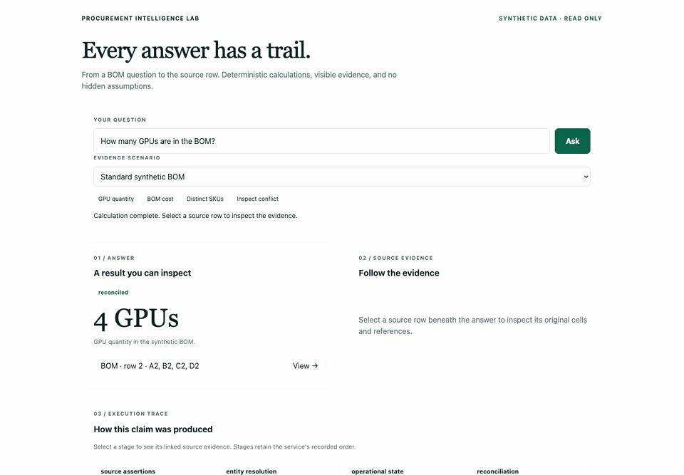

# Procurement Intelligence Lab

Procurement Intelligence Lab is a public, synthetic-data reference architecture for trustworthy BOM and procurement intelligence. It turns semi-structured documents into provenance-preserving knowledge, keeps source assertions distinct from truth, reconciles them into operational state, and exposes deterministic and AI-assisted investigation tools.

Reusable semantic contracts and DomainPackage compilation live under `platform/`; procurement-owned
BOM, BoQ, Purchase Order, state, reconciliation, and anomaly behavior lives under
`domains/procurement/`. See [platform semantics and vertical ownership](docs/architecture/platform-semantics.md).

## At A Glance


**Who and why:** procurement analysts need to understand what is required, what
has been ordered, and where the evidence disagrees. Every material result should
be traceable to the source document, governing policy, scope, and as-of time.

**How:** documents become evidence-backed assertions; explicit resolution and
reconciliation produce operational state; deterministic services derive facts
and assess discrepancies. Models can interpret questions and route investigation,
while those services own quantities, statuses, and policy outcomes.

**Current boundary:** selected synthetic procurement paths run through anomaly
assessment and authenticated human review. The local review workflow persists
exact assessments and supports scoped, prospective reconciliation. Prediction,
procurement decision policy, and external action execution remain future work;
complete gold-data coverage at every boundary is an evaluation goal.

## Showcase

Ask a synthetic BOM question, inspect its deterministic answer, and open the contributing XLSX
row values and cell references. The local inspector also includes four fixed required-quantity
revision scenarios: an abstaining conflict, explicit supersession, equal-value competing revisions,
and a missing-approval case. Each exposes its policy ID, as-of time, retained alternatives, and
original source rows.

[](docs/project/showcase-walkthrough.md)

[2:41 recording and reproduction guide](docs/project/showcase-walkthrough.md) · [Conflict still](docs/assets/showcase/procurement-conflict.png) · [Demo scope and verification](docs/project/inspector-demo-acceptance.md)

Try the live synthetic showcase at [procurement.ediacarian.dedyn.io](https://procurement.ediacarian.dedyn.io/).
Its public release record, verification results, and limits are in the
[deployment evidence note](docs/project/procurement-vps-deployment-2026-09-19.md).

The 25-second animation excerpts the continuous 2:41 browser recording; its cuts and reading pauses are disclosed in the walkthrough. The source panel shows
original cells from admitted XLSX fixtures, highlighted by EvidenceRef. The discrepancy scenario
is governed by [policy v1](docs/product/governing-claim-policy-v1.md) and its
[frozen contract](docs/product/showcase-discrepancy-contract.md). Broader correction workflows
remain separate work.

Start the browser demo with `uv run python -m procurement_intelligence_lab.interfaces.web`, then
open <http://127.0.0.1:8000/>. It runs locally without model services or external credentials.

## Architecture

The full evidence-to-action vision preserves each intermediate artifact:

1. **Source and understanding:** source artifact → structured document →
   schema-mapped structured document → normalized observations → source assertions.
   Structuring captures layout, values, and source coordinates; mapping assigns
   schema meaning. Assertions retain what a source says without declaring it truth.
2. **Identity and governed state:** entity mentions → entity resolution decisions
   → canonical assertions → reconciliation → operational state. Reconciliation
   considers versions, dates, status, and lifecycle stages under explicit policy,
   retaining governing, losing, and conflicting assertions. Operational state is
   the current interpretation of project status from those reconciled assertions.
3. **Intelligence and execution:** derived facts (counts, averages, trends) →
   anomalies (measured deviations from expected norms) → predictions and forecasts
   (uncertain or future states) → decisions (evidence-based policy, rules, and
   thresholds) → authorized actions (alerts and processes). This is the full vision:
   current facts include counts and costs, and current anomaly assessments may
   explicitly abstain. Broad trend analytics and procurement execution are not
   implied by the diagram.

**Gold data and evaluation belong at every boundary.** Expected artifacts and
outcomes should test structuring, mapping, normalization, identity, state, and
downstream intelligence independently. Existing tests, source oracles, and
development-agent challenges cover selected paths; complete boundary-gold
coverage remains future work.

**Human review spans the pipeline and its outcomes.** Current reviewers can
confirm or challenge an assessment, and eligible conflicts can be reconciled for
one exact item + project + site with a required rationale. Reconciliation takes
effect prospectively, retains both alternatives, and preserves earlier as-of
state. Confirming an assessment and selecting a governing revision are distinct
operations. Future procurement decisions and external actions require their own
authority and approval controls.

The diagram shows logical boundaries. The current XLSX adapter physically
combines structuring and mapping; the reusable platform defines typed contracts
through `PREDICT`, `DECIDE`, and `ACT`, but procurement has no executors for those
three stages. Postgres is the intended canonical store; local review persistence
uses SQLite, and search, vector, and graph systems are replaceable projections.
Core semantics are framework-independent Python dataclasses behind ports and
adapters.

Read the [procurement semantic model](docs/domains/procurement/semantic-model.md),
[logical-stage contracts and runtime limits](docs/architecture/universal-stage-semantics.md),
[evidence drill-down](docs/architecture/evidence-and-ux.md), and
[prospective reconciliation contract](docs/adr/034-prospective-human-reconciliation.md)
for the detailed boundaries. The [local review CLI](docs/product/serial-review-workflow-v1.md)
and [authenticated browser review](docs/product/local-browser-review-v1.md) retain
their own acceptance and deployment limits.

## Project memory and status

The repository is the canonical interoperability layer across ChatGPT, Work, Codex, humans, and other development agents. Use [docs/project/handoff.md](docs/project/handoff.md) as the concise fresh-agent index, then follow its links to the authoritative milestone map, ADRs, architecture docs, Issues, and PRs. Chat/Work supports exploration and planning; development agents implement against the repo; GitHub artifacts carry durable shared state.
## Use-case anchors

The first synthetic showcase is organized around three procurement questions:

- which distinct SKUs are required for the next data center;
- how many GPUs are required, ordered, received, and outstanding;
- what a proposed BOM would cost, with explicit prices, assumptions, and missing evidence.

See [the use-case and query contracts](docs/product/use-cases.md) for their evidence, ambiguity, and evaluation requirements.

## Status

The initial evidence-first vertical capabilities are runnable, but the encompassing GitHub milestones remain acceptance-driven and are not implied complete by merged slices. The repository includes a coordinate-aware XLSX adapter, typed line-level evidence, conservative entity resolution, explicit reconciliation precedence, governed claims, constrained chat routing, and a local HTTP inspector with source lookup and reproducible review context.

The M0 semantic-quality harness now separates unit, contract, integration, and regression tests; performs clean-wheel and real HTTP happy-path checks; and records eleven shipped-defect challenges (C001-C011) under `evals/development_agents/challenges/`. `make challenges` requires every oracle to pass on current code and reject its executable known-bad mutation.

M7 now includes the append-only assertion-ledger boundary, timezone-aware as-of reads, the first evidence-backed anomaly taxonomy, and an injectable execution/decision provenance contract. The example execution manifest shows how resolved Compose/configuration values become immutable run and component identities. Durable database storage, broader anomaly orchestration, temporal correction events, retrieval projections, and product-feedback persistence remain later slices.

The canonical delivery map is docs/development/milestone-map.md. Changes to architecture or delivery status must follow the synchronization policy in ADR-012.

## Local entry points

    uv sync --all-groups
    make check
    make eval
    make package-smoke
    make challenges
    make demo

make demo is equivalent to uv run python -m procurement_intelligence_lab. Pass --help to inspect its synthetic-BOM and canonical-candidate inputs.

## Public-data disclaimer

This repository contains no confidential, proprietary, export-controlled, or operational procurement data. Examples and future fixtures must be synthetic or demonstrably public. This is an architectural lab, not a production procurement or decision authority.

### Local review-agent tools and run ledger

The G2 branches expose audited corpus tools with a fixture-only run ledger. Create a run, then resume its ID
from a second process using the same database and project:

```bash
uv run python -m procurement_intelligence_lab.interfaces.agent_runs --database /tmp/procurement-agent-runs.db create --project atlas
uv run python -m procurement_intelligence_lab.interfaces.agent_runs --database /tmp/procurement-agent-runs.db resume --project atlas --run-id <returned-run-id>
```

The same CLI accepts `investigate --item GPU-A --as-of 2026-01-06T00:00:00+00:00`,
`source --evidence-id <returned-evidence-id>` and `finish`, each with the same database,
project and run ID. The [tool contract](docs/product/corpus-agent-tools-v1.md) defines their
strict arguments, existing-service results and actual invocation audit.

Run/thread IDs and version metadata remain bound to the configured synthetic owner scope.
The [run contract](docs/product/review-agent-run-contract-v1.md) defines audit-event completeness
and later exact-brief review/save boundaries. This CLI performs no model inference or brief save.

### Local human brief review

The separate human CLI has fixed local demo review/save permissions. First create a run with
the run CLI, then draft a deterministic brief:

```bash
uv run python -m procurement_intelligence_lab.interfaces.briefs --database /tmp/procurement-agent-runs.db draft --project atlas --run-id <run-id> --item GPU-A --as-of 2026-10-01T00:00:00+00:00
uv run python -m procurement_intelligence_lab.interfaces.briefs --database /tmp/procurement-agent-runs.db review --project atlas --run-id <run-id> --brief-id <brief-id> --digest <digest> --decision approve
uv run python -m procurement_intelligence_lab.interfaces.briefs --database /tmp/procurement-agent-runs.db save --project atlas --run-id <run-id> --brief-id <brief-id> --digest <digest> --idempotency-key <idempotency-key>
```

Use the exact returned brief ID, digest and key. `show` retrieves that immutable packet;
`--decision reject` prevents saving it. A new draft invalidates the old receipt. The local
configuration uses a one-hour approval expiry; repeating review cannot renew it. Repeated saves
acknowledge one durable result. This shell boundary demonstrates local human review mechanics,
not production authentication, graph recovery or live inference. See the
[approval contract](docs/product/exact-brief-review-v1.md).

### Local Qwen review (unmerged implementation branch)

The `codex/local-qwen-interpretation` branch adds one bounded local Qwen 3.6 interpretation per natural-language review question, a durable inference journal and the existing exact human review workflow. Quantities and statuses come from deterministic services. See [commands and contract](docs/product/local-qwen-review-v1.md) and [live evidence](docs/project/local-qwen-review-evidence.md). Nine repeated development walkthroughs plus four abstentions passed. The [actual installed browser slice](docs/project/browser-live-acceptance.md) additionally passes 14 authored live submissions with source/restart/review/save accounting; deployment, fresh held-out evaluation and full G2 acceptance remain open.

The [original January showcase review](docs/product/original-showcase-review-v1.md) additionally
uses three server-configured source sets with original policy/evidence identities. Nine authored
installed live browser trials pass; unresolved requirements retain observed order 2 as
`not_assessed`. This unmerged continuation does not expand the corpus or establish held-out quality.

The [fresh language evaluation](docs/project/fresh-language-evaluation.md) keeps the runtime and
source facts frozen:23/24 independently authored validation/test questions pass, with one valid
cutoff request safely unsupported. Overall47/48 includes 24 root development questions. This
unmerged evaluation remains not_ready; inspected questions cannot stay held-out during tuning.

The [cutoff intent development continuation](docs/project/cutoff-intent-development.md) records
26/28 candidate controls,48/48 inspected-language regression and9/9 original browser trials on the
unmerged draft stack. Two valid-request abstentions remain. The prior language cohort is retired
for tuning; these are development observations, not fresh quality or full G2 readiness.


The [fresh v3 candidate evaluation](docs/project/fresh-language-v3-evaluation.md) passes 48/48 new
questions, including 24 independently authored questions, on the unchanged cutoff candidate.
Installed 48 gold/464 source checks and 48 model calls/56 tools/28 exact saves reconcile. This unmerged
language-only result keeps full G2/release, comprehensive accessibility, deployment and source
expansion separate; the source corpus remains four known projects.

The [installed adversarial probes](docs/project/g2-adversarial-acceptance.md) pass nine failure
guards, including a real process death after durable save and exact recovery. Five real Qwen and
three controlled protocol attempts are counted separately; actual tool failure remains visible.
This unmerged result requires complete causal/approval evidence and keeps full G2/release,
comprehensive accessibility, deployment and corpus expansion as separate gates.

The [G2 acceptance dossier](docs/project/g2-acceptance-dossier.md) consolidates original browser,
fresh language, failure guards and a measured installed deterministic baseline with pinned artifacts.
Historical misses and separate latency/cost scopes remain visible. It uses zero new model requests;
full release/browser/deployment and source expansion remain gated.
