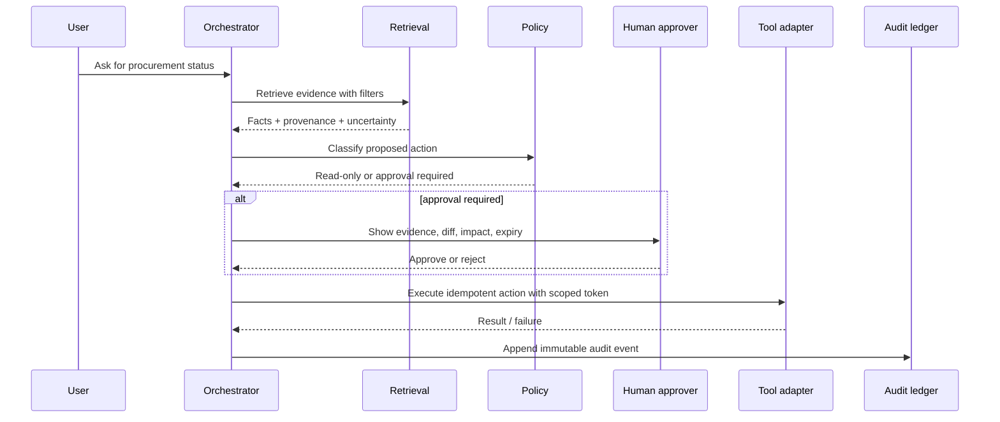

# Agent workflows and controls

The agent is a coordinator over typed tools, not an unrestricted operator.

Required controls include least-privilege service identities, tenant/project scope checks, tool schemas, dry-run previews, approval expiry, idempotency keys, replay protection, rate limits, and a complete record of prompt-independent evidence used for the decision.
