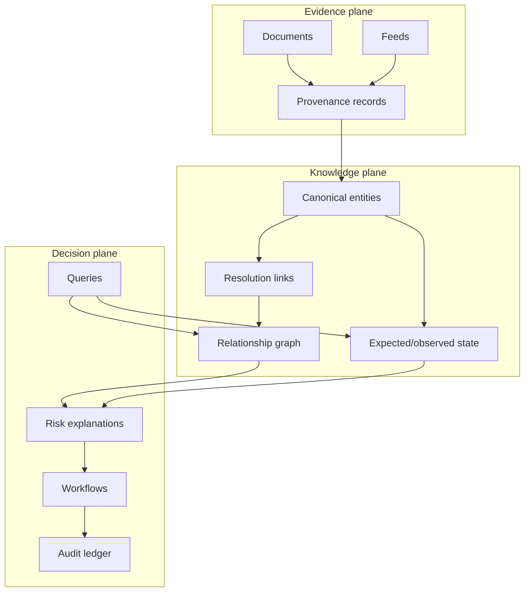

# Architecture and tradeoffs

## Design principles

1. Evidence before inference: every extracted fact carries source, location, timestamp, and confidence.
2. Identity is explicit: aliases are observations; canonical IDs are governed records.
3. State is temporal: expected commitments and observed events must be compared as-of a known time.
4. Retrieval is plural: structured filters, lexical search, semantic similarity, and graph traversal answer different questions.
5. Actions are higher risk than answers: authorization, approval, idempotency, and audit are mandatory boundaries.

## Bounded context

## Canonical entity model

The prototype keeps the model deliberately small. A production implementation would version schemas and preserve raw observations rather than overwriting them.

| Entity | Key fields | Important relationships |
|---|---|---|
| `Item` | canonical SKU, description, unit | requested by project, supplied by vendor |
| `Vendor` | canonical vendor ID, names, regions | offers item, owns commitment |
| `Document` | hash, source URI, captured time | supports extracted fact |
| `Commitment` | quantity, promised date, status | item + vendor + project |
| `Event` | type, occurred time, observed payload | updates observed state |
| `Milestone` | required date, dependency | constrains commitment |

## Tradeoffs

- Relational core vs graph-first: relational constraints and temporal updates are easier to govern; graph projections help relationship exploration. Start relational, project selectively.
- Lexical vs vector retrieval: lexical search is inspectable and strong on part numbers; vectors help paraphrase and noisy descriptions. Use both and expose which signals contributed.
- Batch vs streaming: batch is simpler for initial reconciliation; streaming is valuable for time-sensitive exceptions. Preserve replayability in either case.
- LLM extraction vs deterministic parsing: use deterministic parsing where structure exists, LLM extraction only with schemas, confidence, provenance, and review thresholds.
- Early agent autonomy vs approval gates: automate recommendations first; require explicit approval for external side effects.
