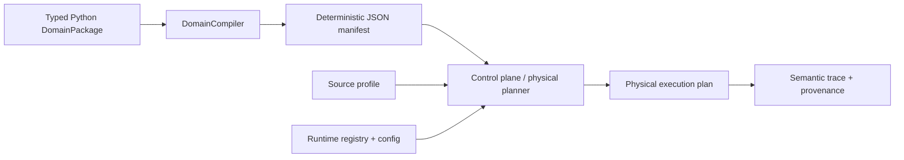

# Domain packages and stage planning

Status: proposed target architecture. This document defines a direction and vocabulary; it does not claim that the compiler, capability registry, physical planner, or multi-domain runtime is implemented on `main`.

The goal is to make procurement one vertical on a reusable evidence-first platform without moving procurement meaning into provider adapters or making a future control plane aware of domain names. Four layers keep those responsibilities separate.

## Four layers

| Layer | Owner | Responsibility | Must not contain |
|---|---|---|---|
| `StageDefinition` | platform | Universal stage meaning, input/output contracts, semantic guarantees, and allowed logical topology | Procurement rules or provider selection |
| `StageBinding` | domain | A vertical's mode, semantic requirements, policy/config references, and evaluation-suite reference for one standard stage | `run()`/`execute()` behavior or ordinary provider/model/service names |
| strategy/policy | platform contract plus domain selection and parameters | Platform-defined strategy semantics with domain-selected policy and domain parameters | Hidden provider mechanics or unversioned executable callbacks |
| `ImplementationConfig` and runtime registry | deployment/runtime | Provider/adaptor selection, service/model versions, regions, credentials references, and capability advertisement | Domain-specific branching or redefinition of stage semantics |

This means `docling-v1`, `textract-v2`, Splink, Semantica, a model ID, or a cloud region normally does **not** belong in a `StageBinding`. Those are runtime choices. A binding may instead require capabilities such as table recovery, page coordinates, conservative resolution, or human-review routing.

## Platform-owned logical pipeline

The platform owns the stable logical order:

```text
INGEST -> STRUCTURE -> MAP -> NORMALIZE -> ASSERT -> RESOLVE
       -> RECONCILE -> DERIVE -> DETECT -> PREDICT -> DECIDE -> ACT
```

These stages preserve the repository's existing semantic model:

| Stage | Representative input | Representative output and guarantee |
|---|---|---|
| `INGEST` | external source reference or event | immutable `Artifact` plus capture identity |
| `STRUCTURE` | `Artifact` | `StructuredDocument`; recover physical/logical structure without assigning domain meaning |
| `MAP` | `StructuredDocument` | `MappedDocument`; assign domain schema meaning while retaining source locations and ambiguity |
| `NORMALIZE` | mapped values | comparable normalized observations with units, value diagnostics, and provenance |
| `ASSERT` | normalized observations | source assertions and entity mentions; claims remain distinct from truth |
| `RESOLVE` | assertions, mentions, and candidate context | resolution decisions and canonicalized assertions; unresolved identity remains valid |
| `RECONCILE` | canonicalized assertions and policy inputs | reconciliation decisions and governed operational state while retaining losing/conflicting claims |
| `DERIVE` | governed state | deterministic derived facts with evidence links |
| `DETECT` | state and derived facts | anomalies distinct from predictions, decisions, and actions |
| `PREDICT` | scoped evidence/state | predictions with model/execution provenance and uncertainty |
| `DECIDE` | facts, anomalies, predictions, and policy | decisions or recommendations with explicit authority and evidence |
| `ACT` | approved decision | auditable, authorized, idempotent action result |

Intermediate types such as `EntityMention`, `ResolutionDecision`, `CanonicalizedAssertion`, `ReconciliationDecision`, and `OperationalState` remain explicit contracts even when they are not separately schedulable stages.

A domain package binds requirements to this topology. It does not add arbitrary edges or reorder stages. If a vertical genuinely requires a different semantic order, that is a platform architecture change requiring an ADR and migration analysis, not ordinary domain configuration.

## Stage definitions and bindings

`StageDefinition` is a platform catalog entry. It defines meaning once for every domain.

```python
@dataclass(frozen=True)
class StageDefinition:
    stage: StageId
    input_contract: ContractRef
    output_contract: ContractRef
    semantics: SemanticsRef
    guarantees: tuple[Guarantee, ...]
```

`StageBinding` is declarative domain data. Input and output contracts are inherited from the stage definition instead of being duplicated and allowed to drift.

```python
class StageMode(Enum):
    EXECUTE = "execute"
    PASSTHROUGH = "passthrough"
    EMPTY = "empty"


@dataclass(frozen=True)
class StageBinding:
    stage: StageId
    mode: StageMode
    requirements: tuple[Requirement, ...] = ()
    domain_config_ref: ConfigRef | None = None
    policy_refs: tuple[PolicyRef, ...] = ()
    eval_suite_ref: EvalSuiteRef | None = None

    @property
    def is_executable(self) -> bool: ...

    @property
    def produces_output(self) -> bool: ...

    def required_capabilities(self) -> frozenset[CapabilityId]: ...

    def validate_against(self, definition: StageDefinition) -> None: ...
```

These methods only inspect or validate declarative state. `StageBinding.run()` and `StageBinding.execute()` are rejected: the runtime/control plane executes a physical plan through platform ports and adapters.

References in a binding point to versioned, declarative domain-owned records. Importing a domain package constructs data only. It performs no I/O, starts no services, reads no ambient secrets, and supplies no arbitrary executable domain algorithms.

## Fixed `DomainPackage` meta-schema

Every domain structurally supplies one binding for every standardized stage. Absence is explicit and typed rather than represented by omitted keys or a generic `None`.

```python
@dataclass(frozen=True)
class DomainPackage:
    schema_version: str
    domain_id: DomainId
    domain_version: str
    ingest: IngestBinding
    structure: StructureBinding
    map: MapBinding
    normalize: NormalizeBinding
    assert_claims: AssertBinding
    resolve: ResolveBinding
    reconcile: ReconcileBinding
    derive: DeriveBinding
    detect: DetectBinding
    predict: PredictBinding
    decide: DecideBinding
    act: ActBinding
    source_profiles: tuple[SourceProfile, ...]
```

The three neutral modes have distinct semantics:

- `EXECUTE`: invoke an implementation satisfying the binding's requirements.
- `PASSTHROUGH`: the source or prior stage already satisfies the output contract; validate that claim and retain the semantic trace.
- `EMPTY`: intentionally produce the stage's typed empty result. It is not an unknown or a failure.

Typed neutral bindings make stage-specific behavior clear. Examples include `StructuredInputPassthrough`, `AuthoritativeOnlyResolution`, `NoForecasting`, and `NoActions`. They may share platform helpers, but the manifest must preserve the affected stage, neutral semantics, validation rule, and output contract. One untyped null transformer would hide those differences.

## Procurement examples

### STRUCTURE

The platform definition says: recover document structure without assigning procurement meaning. A procurement binding may require tables, reading order, bounding boxes, and page coordinates:

```python
StructureBinding(
    stage=StageId.STRUCTURE,
    mode=StageMode.EXECUTE,
    requirements=(
        Capability("tables"),
        Capability("reading_order"),
        Capability("bounding_boxes"),
        Capability("page_coordinates"),
    ),
    domain_config_ref=ConfigRef("procurement.structure/table-aware@1"),
    eval_suite_ref=EvalSuiteRef("procurement.structure@2"),
)
```

Runtime configuration can choose Docling, Textract, or another adapter that satisfies those capabilities. Changing that choice does not change the procurement package.

### RESOLVE

A procurement binding may require authoritative identifiers, probabilistic or contextual evidence, conservative false-merge behavior, abstention, and human review:

```python
ResolveBinding(
    stage=StageId.RESOLVE,
    mode=StageMode.EXECUTE,
    requirements=(
        Capability("authoritative_ids"),
        Capability("probabilistic_evidence"),
        Capability("contextual_evidence"),
        Capability("abstention"),
        Capability("human_review"),
    ),
    policy_refs=(PolicyRef("procurement.resolve/conservative-item@3"),),
    eval_suite_ref=EvalSuiteRef("procurement.resolve@4"),
)
```

The runtime may select Splink, Semantica, or a project-owned implementation after capability validation and benchmark evidence. The domain contract continues to make unresolved identity valid and false merges more costly than abstention.

### RECONCILE

The platform owns reconciliation strategy semantics and the implementation contract. Procurement selects a platform strategy and supplies predicate-specific authority parameters:

```python
ReconcileBinding(
    stage=StageId.RECONCILE,
    mode=StageMode.EXECUTE,
    policy_refs=(
        PolicyRef("platform.reconcile/latest-authoritative@1"),
        PolicyRef("procurement.authority/delivery-status@2"),
    ),
)
```

The procurement authority record might state that a vendor-confirmed delivery update outranks a purchase-order promise for `observed_delivery_date`, subject to scope, review, and effective-time rules. That parameterization is domain policy; the meaning of `latest-authoritative`, conflict retention, and the executor contract remain platform-owned.

## Source profiles

One domain can bind a stage differently by source type while still converging on common downstream contracts. A source profile selects a validated variant of the domain bindings; it does not create a new DAG.

```text
PDF BOM       -> STRUCTURE(EXECUTE)     -> MAP -> NORMALIZE
ERP API event -> STRUCTURE(PASSTHROUGH) -> MAP -> NORMALIZE

both -> ASSERT -> RESOLVE -> RECONCILE -> common knowledge/state pipeline
```

`StructuredInputPassthrough` must validate that an ERP event already satisfies the `StructuredDocument` output contract. It cannot silently reinterpret an arbitrary payload as structured data.

## Compilation and physical planning

The authoring and execution flow is:



The `DomainCompiler` validates every binding against the platform stage catalog, validates referenced strategy/policy schemas, resolves source-profile variants, and emits deterministic canonical JSON. The compiled manifest is language-neutral and consumable by Python, Go, runtime services, UIs, and MCP authoring tools.

The control plane combines three inputs:

1. the compiled domain manifest;
2. the selected source profile; and
3. the runtime implementation registry and deployment configuration.

It validates capability compatibility and produces an optimized physical execution plan. `PASSTHROUGH` and `EMPTY` stages may be fused or omitted physically, but they remain explicit in semantic traces and provenance. A physical optimization must not make it impossible to tell that a stage was already satisfied or intentionally produced no outputs.

## Compiled manifest boundary

The compiled manifest identifies semantics and requirements, not packages or vendors. This abridged excerpt shows two of the required stage entries:

```json
{
  "domain_package_schema_version": "1.0",
  "domain": {"id": "procurement", "version": "0.3.0"},
  "stages": [
    {
      "stage": "STRUCTURE",
      "mode": "EXECUTE",
      "requirements": [
        "tables",
        "reading_order",
        "bounding_boxes",
        "page_coordinates"
      ],
      "domain_config_ref": "procurement.structure/table-aware@1",
      "policy_refs": [],
      "eval_suite_ref": "procurement.structure@2"
    },
    {
      "stage": "PREDICT",
      "mode": "EMPTY",
      "neutral_semantics": "no_forecasting",
      "requirements": [],
      "policy_refs": [],
      "eval_suite_ref": "procurement.predict-empty@1"
    }
  ]
}
```

The manifest must be deterministic: equivalent authoring objects produce byte-equivalent canonical output and the same compiled-manifest hash.

## Implementation descriptors and capability registry

Concrete adapters/providers register deployment-owned descriptors. A descriptor advertises:

- stage and capability IDs it implements;
- semantic contract versions it supports;
- configuration schema ID and version;
- implementation/provider/model/service version fields needed for provenance;
- resource, locality, trust, and operational requirements; and
- typed incompatibility and startup-validation failures.

Compilation or startup fails closed if the selected implementation does not satisfy a binding. This creates a benchmarkable swap boundary: keep the same procurement package and evaluation corpus, then compare Docling with Textract or Splink with Semantica without editing domain semantics.

Provider names may appear in runtime configuration and execution provenance. They do not appear in the portable domain manifest unless a provider-specific behavior has first been promoted into a platform capability with provider-neutral semantics.

## Configuration formats and side-effect boundary

| Concern | Format | Boundary |
|---|---|---|
| Rich domain authoring | typed Python dataclasses/objects | declarative construction only |
| Compiled domain artifact | deterministic canonical JSON | portable contract for runtimes, Go, Python, UI, and MCP |
| Runtime/application configuration | TOML plus environment/secret references | implementation selection and effective runtime settings |
| Deployment/orchestration | ecosystem-native YAML | Docker Compose, Kubernetes, and GitHub Actions mechanics |

The existing effective execution-manifest example is a resolved provenance input, not a substitute for the compiled domain manifest. Secrets and raw environment values remain outside both artifacts.

## Control-plane and future Go boundary

A future Go control plane consumes validated compiled manifests plus the runtime registry/config. It never imports Python authoring objects, invokes arbitrary Python domain callbacks, or branches on code such as `if domain == "procurement"`.

The manifest says which stage, mode, capabilities, policy/config references, and evaluation contract apply. The runtime registry resolves those requirements to a physical implementation or service. Domain-specific behavior is introduced through validated data and platform-defined strategy contracts, not domain-name conditionals.

## Versions and provenance

The system records distinct identities for:

| Identity | What changed when it changes |
|---|---|
| DomainPackage schema version | platform meta-schema or manifest contract |
| domain ID and domain version | domain requirements, policies, or configuration |
| compiled manifest hash | exact validated semantic artifact |
| runtime implementation/provider/model version | physical executor, service, or model |
| application/code version | compiler, control-plane, runtime, and adapter code |

Execution provenance also retains the selected source profile, effective runtime-config digest, implementation descriptor versions, and the existing evidence/transformation links. This separation makes it possible to determine whether a result changed because domain policy changed, an implementation/model changed, application code changed, or the source/input snapshot changed.

## Adoption sequence

This proposal becomes an implemented platform boundary only after the roadmap work lands in reviewable slices:

1. ratify the platform stage catalog, fixed meta-schema, neutral modes, and manifest schema;
2. extract the current procurement semantics into a `DomainPackage` without changing observed behavior;
3. implement deterministic compilation and manifest validation;
4. implement runtime registry loading, capability validation, and logical-to-physical planning;
5. add SME/MCP authoring and validation tools that edit declarative packages rather than runtime code; and
6. prove portability with a second vertical and shared conformance/evaluation suites.

Until those slices are implemented and accepted, current repository types and application services remain authoritative for behavior on `main`.
