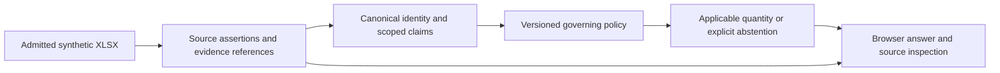

# Procurement showcase: an answer, a conflict, and its evidence

Recorded 2026-09-19 from application revision `88297758bdc9025167ed830cce743a14fdaa75ac`.
Part of [#50](https://github.com/stauntonjr/procurement-intelligence-lab/issues/50) and
[#73](https://github.com/stauntonjr/procurement-intelligence-lab/issues/73).

[Open the captioned player](../showcase/procurement/index.html) ·
[Download the 2:41 MP4](../assets/showcase/procurement-walkthrough.mp4) ·
[Captions](../assets/showcase/procurement-walkthrough.vtt) ·
[Try the synthetic inspector](https://procurement.ediacarian.dedyn.io/)

The problem is simple: two source documents can disagree about a requirement. The system must
explain what is established, which policy applies, and which evidence remains unresolved.
Use this three-minute guide with the recording; no installation is needed to review the media.
The HTML player is a repository artifact to serve locally, not a newly deployed public site.

## Walkthrough and expected results

| Time | Action | What to inspect |
|---|---|---|
| 0:00 | Read the synthetic/read-only boundary | This is a bounded architecture showcase. |
| 0:12 | Ask the default GPU question | `4 GPUs`, `reconciled`; deterministic source quantity. |
| 0:22 | Open its source row | `GPU-A`, quantity `4`, unit price `100`; original highlighted XLSX cells. |
| 0:37 | Select reconciliation in the trace | The recorded stage links to its source evidence. |
| 0:48 | Choose competing approved revisions | `Not established`; A says 4 and B says 6. Expected state is not projected. |
| 1:06 | Open revision B | The original row says 6; the disagreement remains visible. |
| 1:21 | Choose explicit supersession | `6 GPUs`; B governs and A is retained as superseded. This is not addition. |
| 1:50 | Choose equal-value revisions | `4 GPUs`, `governed_shared_value`; both revisions remain evidence. |
| 2:09 | Choose missing approval | `Not established`, not zero; a newer document alone is insufficient authority. |
| 2:27 | Restore the standard scenario | The original quantity/source flow remains available. |

The revision scenarios use `procurement-governing-claims/v1`, scope
`synthetic-tenant / synthetic-project / synthetic-site`, and as-of `2026-01-15T00:00:00+00:00`.
See the [frozen discrepancy contract](../product/showcase-discrepancy-contract.md) and
[policy](../product/governing-claim-policy-v1.md). Calculation, eligibility and state projection
belong to application/domain services; the browser renders their typed response.

## Architecture in one view



This is a summary of the demonstrated path. The [architecture specification](../architecture.md)
contains the broader platform topology and separates implemented adapters from future work.

## Reproduce locally

Prerequisites: Git, uv, Python 3.12 or 3.13, and a browser. Initial dependency installation may
need network access; after that, the demonstrated application runs without model services,
credentials, a database service, or network retrieval.

```sh
git clone https://github.com/stauntonjr/procurement-intelligence-lab.git
cd procurement-intelligence-lab
git checkout 88297758bdc9025167ed830cce743a14fdaa75ac
uv sync --locked --all-groups
uv run --offline python -m procurement_intelligence_lab
uv run --offline python -m procurement_intelligence_lab.interfaces.web --port 8765
```

Open `http://127.0.0.1:8765/` and follow the table above. Fixtures load from the installed package;
there is no separate ingestion or database setup for this demo. Source-row buttons open the
admitted workbook; recorded stages and **Inspect the full response** expose the trace.

To reset, stop this foreground server with Ctrl-C and rerun its command, then reload the browser.
The demo has no persisted user mutations. To rebuild the isolated environment without deleting
an existing one, set `UV_PROJECT_ENVIRONMENT=.venv-showcase-rebuild` for both `uv sync --locked
--all-groups` and the subsequent `uv run --offline ...` commands.

To play this packet with browser captions after checking out the packet revision, serve the
repository using `uv run --offline python -m http.server 8767 --bind 127.0.0.1` and open
`http://127.0.0.1:8767/docs/showcase/procurement/`. The recorded application revision above predates
these new media files; it is pinned to reproduce behavior, not to locate the packet.

## Verification and media provenance

- A fresh source export and new virtual environment completed `uv sync --locked --all-groups`
  in 0.450 seconds using the existing uv cache. This is a warm-cache observation, not a first
  download or universal setup-time claim.
- The offline CLI returned valid JSON. Two independently started local server processes returned
  identical complete responses, including evidence, for standard, conflict, superseded,
  shared-value and missing-approval scenarios. The fresh environment also exercises rebuild.
- The recorded browser performed real submissions and source clicks. No response, result, or
  source cell was mocked, injected, or edited. The 160.56-second MP4 preserves the continuous
  capture with deliberate reading pauses, no audio, and no speed changes; it is not a latency test.
- The 25-second GIF uses source intervals 12–17, 22–27, 48–53, 65–70 and 81–86 seconds. Its jumps
  are disclosed excerpts. The prior basic-demo GIF and PNG remain unchanged.
- [Manifest](../assets/showcase/manifest.json) records source/media hashes, fixture hashes and
  capture identity; [events](../assets/showcase/capture-events.json) and
  [restart evidence](../assets/showcase/reproduction.json) retain the observed boundaries.

The public deployment has its own [release record](procurement-vps-deployment-2026-09-19.md).
This packet does not certify a new deployment, complete #50/#73/#74, or establish production
readiness. There are no customer uploads, purchasing actions, full correction workflows,
forecasting results, or unrestricted conversational understanding in this recording.

## Packet checks

On this documentation/media candidate, `make check` passed: 260 tests, 89.26% coverage,
coverage ratchet, formatting, lint, types and architecture checks. Media digests and every local
link in the new guide/player resolved. Chrome 153.0.8010.48 played the MP4, advancing to 1.003
seconds, and loaded all eleven English caption cues; the player fit desktop and 390-pixel
viewports without page overflow. Decoded MP4 and GIF conflict frames matched the recorded source
row and unresolved result. For small screens, full-screen or downloaded playback makes source
text easier to inspect. Browser playback is separate from Python coverage.
